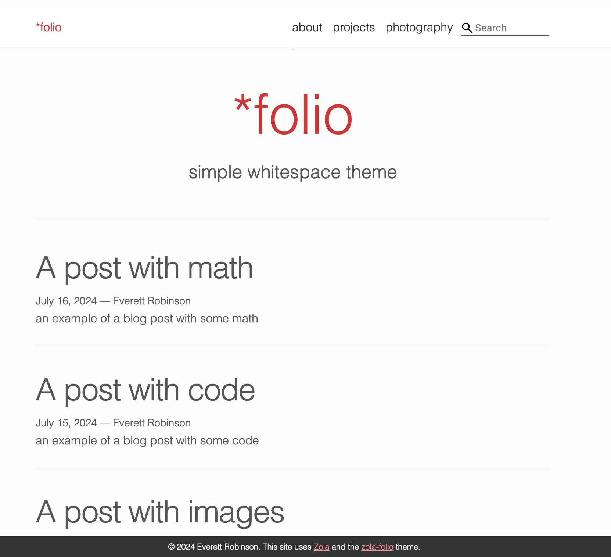

# *folio

[](https://zola-folio.pages.dev/)

*folio is a [Zola](https://www.getzola.org) theme forked from the [original Jekyll theme by Lia Boegev](https://github.com/bogoli/-folio/tree/master).

**[Live Demo](https://zola-folio.pages.dev/)**

## Features

- [x] Menu bar
- [x] Social links
- [x] Tags
- [x] MathJax
- [x] Search
- [x] Customizable color
- [ ] Multi-language support
- [ ] SEO tags

## Installation

In the git repo of your zola site:

### Add the theme as a git submodule:

```bash
git submodule add https://github.com/evjrob/zola-folio themes/zola-folio
git submodule update --init --recursive
git submodule update --remote --merge
```

### Or clone the theme directly into your themes directory:

```bash
git clone https://github.com/evjrob/zola-folio themes/zola-folio
```

Then set `theme = "zola-folio"` in your config.toml file. You can now test the theme locally by running `zola serve` in the terminal and navigating to the localhost URL displayed by the command.

## Configuration

### Menu Bar

Items in the top menu bar can be controlled with the `extra.menu_items` setting in config.toml:

```toml
menu_items = [
    {name = "about", url = "/pages/about"},
    {name = "projects", url = "/pages/projects"},
    {name = "photography", url = "/pages/photography"},
]
```

### About Page Social Contacts

If you have an about page, you can add social contact links using the `extra.socials` setting in the frontmatter of the page:

```toml
+++
title = "about"
template = "about.html"
[extra]
socials = [
	{name = "email", uri = "mailto:you@example.com"},
	{name = "github", uri = "https://github.com"},
	{name = "instagram", uri = "https://www.instagram.com/"},
	{name = "bluesky", uri = "https://bsky.app/"}
]
+++
```

### MathJax

MathJax can be enabled by setting `extra.math` in config.toml:

```toml
[extra]
math = true
```
[Example](https://zola-folio.pages.dev/math/).

### Search

Search using elasticlunr.js:

```toml
default_language = "en"
build_search_index = true

[search]
include_title = true
include_description = true
include_path = true
include_content = true
index_format = "elasticlunr_json"
```

### Customizable Colors

Simply set the `extra.theme_color` in the config.toml:

```toml
[extra]
theme_color = "red"|"blue"|"green"|"purple"
```
If the existing colors are not to your liking, then you can create your own by adding a **sass/color/custom.scss** file with the following:

```scss
:root {
    --theme-color: #ffffff;
    --theme-color-light: #ffffff;
}
```
Then set `theme_color = "custom"`.